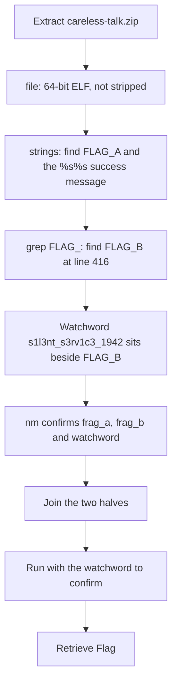

<h1 align="center">📻 Careless Talk</h1>
<p align="center">
  <b>MetaCTF September 2026 Flash CTF Binary Exploitation Write-Up</b>
</p>
<p align="center">
  <a href="https://compete.metactf.com/652/"></a>
  
  
</p>
<p align="center">
  Static String Analysis, Split Flags, and a Hardcoded Watchword
</p>

---

# 📋 Environment

| Item       | Value                                                                                                        |
| ---------- | ------------------------------------------------------------------------------------------------------------ |
| Event      | [MetaCTF September 2026 Flash CTF](https://compete.metactf.com/652/) (MetaCTF has since rebranded as SkillBit) |
| Category   | Binary Exploitation                                                                                          |
| Difficulty | Easy (100 pts, solved by 273 teams)                                                                          |
| Tools Used | file, strings, grep, nm                                                                                      |
| Techniques | Static string extraction, symbol table review, hardcoded credential recovery                                 |

---

# 🗺️ Overview

> *The harbour signals office survived the war by saying nothing. A terminal from that room turned up in an estate sale, still powered, still asking for a watchword nobody alive remembers. The clerks kept their secret, and nobody ever thought to ask whether the terminal kept its own.*

Careless Talk is a warm-up binary exploitation challenge. The handout is a small x86-64 Linux program that asks for a watchword and prints the flag when it gets the right one. Nothing needs to be disassembled or guessed. The flag is stored in the program as plain text, split into two pieces far apart in the file, and the watchword sits right next to the second piece.

The challenge walks through:
* 🔍 Identifying the binary
* 🧵 Pulling readable strings out of it
* 🧩 Following the `FLAG_A` naming to find `FLAG_B`
* 🔑 Confirming the result with the hardcoded watchword

The description spells out the weakness: *"nobody ever thought to ask whether the terminal kept its own [secret]."* A program that checks a password has to contain that password, and a program that prints a flag has to contain the flag.

---

# 📑 Table of Contents

1. [Step 1 - Identifying the Binary](#step-1---identifying-the-binary)
2. [Step 2 - Pulling the Strings](#step-2---pulling-the-strings)
3. [Step 3 - Finding the Second Half](#step-3---finding-the-second-half)
4. [Step 4 - Confirming With the Watchword](#step-4---confirming-with-the-watchword)
5. [Attack Chain Summary](#attack-chain-summary)
6. [Lessons and Takeaways](#lessons-and-takeaways)

---

# Step 1 - Identifying the Binary

The archive contains the program and a short README:

```text
$ unzip -l careless-talk.zip
  Length      Date    Time    Name
---------  ---------- -----   ----
        0  2026-09-22 14:13   careless-talk/
    37056  2026-09-22 14:13   careless-talk/careless-talk
      125  2026-09-22 14:13   careless-talk/README.txt

$ file careless-talk
careless-talk: ELF 64-bit LSB pie executable, x86-64, version 1 (SYSV), dynamically linked,
interpreter /lib64/ld-linux-x86-64.so.2, for GNU/Linux 3.2.0, not stripped
```

It's a 64-bit Linux executable, and it's **not stripped**, so its function and variable names are still inside it.

---

# Step 2 - Pulling the Strings

`strings` lists every run of readable text in the file. There are a lot of them:

```text
$ strings careless-talk | wc -l
490
```

Most are filler: hundreds of fake log and config messages about convoys, harbours and relays. But near the top, the interesting ones appear together:

```text
$ strings careless-talk | sed -n '27,30p'
FLAG_A=SkillBit{c4r3l355_t4lk_
--journal
watchword: 
Watchword accepted. %s%s
```

That's half the flag, and two strong hints about the rest:

* The label **`FLAG_A`** implies there's a **`FLAG_B`**.
* The success message **`Watchword accepted. %s%s`** prints two strings back to back, which is the two halves joined together.

> [!TIP]
> The `--journal` option just prints the filler messages (380 lines of them). It's a decoy and has nothing to do with the flag.

---

# Step 3 - Finding the Second Half

Searching for the `FLAG_` label finds both pieces:

```text
$ strings careless-talk | grep -n FLAG_
27:FLAG_A=SkillBit{c4r3l355_t4lk_
416:FLAG_B=c05t5_l1v35}
```

The second half is almost 400 lines further down, buried after the filler. The lines just before it show something else useful:

```text
$ strings careless-talk | sed -n '414,416p'
unable to retry dispatch table
s1l3nt_s3rv1c3_1942
FLAG_B=c05t5_l1v35}
```

`s1l3nt_s3rv1c3_1942` ("silent service 1942") doesn't look like any of the filler around it. Because the binary isn't stripped, its symbol table shows exactly what each piece is:

```text
$ nm careless-talk | grep -E "frag|watchword"
0000000000004000 r frag_a
00000000000065c0 r frag_b
00000000000065a0 r watchword
```

`frag_a` and `frag_b` are the two flag halves, and `watchword` is stored right before `frag_b`. Dropping the labels and joining the halves gives the flag:

```text
SkillBit{c4r3l355_t4lk_ + c05t5_l1v35} = SkillBit{c4r3l355_t4lk_c05t5_l1v35}
```

---

# Step 4 - Confirming With the Watchword

Giving the program its own watchword makes it print the flag itself:

```text
$ echo s1l3nt_s3rv1c3_1942 | ./careless-talk
=== Harbour Signals Office ===
Careless talk costs lives. State the watchword.
watchword: Watchword accepted. SkillBit{c4r3l355_t4lk_c05t5_l1v35}
```

The output matches the flag rebuilt from the strings.

---

# 🚩 Flag

```text
SkillBit{c4r3l355_t4lk_c05t5_l1v35}
```

---

# Attack Chain Summary



---

# Lessons and Takeaways

## Weaknesses Encountered

|#|Weakness|CWE|Location|
|---|---|---|---|
|1|Hardcoded password|CWE-259|`watchword` symbol in `.rodata`|
|2|Secret stored in plain text in the binary|CWE-312|`frag_a` and `frag_b` in `.rodata`|
|3|Unstripped binary exposing symbol names|CWE-200|Symbol table (`nm`)|

---

## Key Habits Reinforced

* **Run `strings` First:** Before opening a disassembler or running an unknown program, check its readable text. Hardcoded passwords and secrets often sit there in plain sight.
* **Follow Naming Patterns:** A label like `FLAG_A` means there's a `FLAG_B` somewhere. Searching for the shared prefix finds every piece at once.
* **Read Format Strings:** `%s%s` in a success message shows how many pieces the output is built from.
* **Check the Symbol Table:** An unstripped binary names its own variables. `nm` turned "a suspicious string" into "the variable called `watchword`".

---

Written by **TheDingo8MyBaby**
MetaCTF September 2026 Flash CTF • Careless Talk
