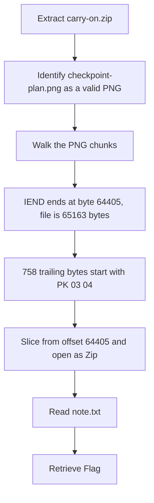

<h1 align="center">🧳 Carry On</h1>
<p align="center">
  <b>MetaCTF September 2026 Flash CTF Forensics Write-Up</b>
</p>
<p align="center">
  <a href="https://compete.metactf.com/652/"></a>
  
  
</p>
<p align="center">
  PNG Chunk Structure, Appended Data, and a Zip Hidden Behind IEND
</p>

---

# 📋 Environment

| Item       | Value                                                                                                        |
| ---------- | ------------------------------------------------------------------------------------------------------------ |
| Event      | [MetaCTF September 2026 Flash CTF](https://compete.metactf.com/652/) (MetaCTF has since rebranded as SkillBit) |
| Category   | Forensics                                                                                                    |
| Difficulty | Easy (50 pts, solved by 277 teams)                                                                           |
| Tools Used | Python 3, unzip, file                                                                                        |
| Techniques | PNG chunk walking, trailing-data detection, Zip carving                                                      |

---

# 🗺️ Overview

> *Someone tried to walk something sensitive out of the facility last night on a USB stick. It held one file, a plan of the security screening hall, and nothing about that looked out of place. The drawing is genuine and opens exactly as it should, which is why it very nearly worked.*
>
> *The file is heavier than the picture it shows. Work out what gave it away, and what they were carrying.*

Carry On is a file-smuggling challenge. The handout is a PNG floor plan of an airport screening hall that opens normally in any viewer. The picture itself has nothing to do with the answer. A Zip archive is attached to the end of the PNG, after the point where image viewers stop reading, and the note inside it holds the flag.

The challenge walks through:
* 🖼️ Checking the PNG's structure chunk by chunk
* ⚖️ Finding the bytes left over after the image ends
* 📦 Identifying and opening the hidden Zip archive
* 🔑 Reading the smuggled note to get the flag

The description gives the whole approach away: *"The file is heavier than the picture it shows."* Something extra is riding along with the image.

---

# 📑 Table of Contents

1. [Step 1 - Inspecting the Handout](#step-1---inspecting-the-handout)
2. [Step 2 - Walking the PNG Chunks](#step-2---walking-the-png-chunks)
3. [Step 3 - Identifying the Payload](#step-3---identifying-the-payload)
4. [Step 4 - Extracting the Note](#step-4---extracting-the-note)
5. [Attack Chain Summary](#attack-chain-summary)
6. [Lessons and Takeaways](#lessons-and-takeaways)

---

# Step 1 - Inspecting the Handout

The archive contains one file:

```text
$ unzip -l carry-on.zip
  Length      Date    Time    Name
---------  ---------- -----   ----
        0  2026-09-22 14:13   carry-on/
    65163  2026-09-22 14:13   carry-on/checkpoint-plan.png

$ file carry-on/checkpoint-plan.png
carry-on/checkpoint-plan.png: PNG image data, 1400 x 900, 8-bit/color RGB, non-interlaced
```

It's a genuine 1400×900 PNG, and it opens as a plain line drawing. At 65,163 bytes, the question is whether all of those bytes actually belong to the image.

---

# Step 2 - Walking the PNG Chunks

A PNG is an 8-byte signature followed by a series of **chunks**. Each chunk is a 4-byte length, a 4-byte type, the data, and a 4-byte CRC. The last chunk is always `IEND`, and image viewers stop reading there. Anything after `IEND` is ignored when the picture is displayed.

Walking the chunks shows where the image really ends:

```python
import struct

d = open('checkpoint-plan.png', 'rb').read()
i = 8                                    # skip the PNG signature
while i < len(d):
    length, = struct.unpack('>I', d[i:i+4])
    ctype = d[i+4:i+8]
    print(i, ctype, length, d[i+8:i+8+min(length, 60)] if ctype != b'IDAT' else '')
    i += 12 + length                     # length + type + data + CRC
    if ctype == b'IEND':
        break

print('end of IEND at', i, 'file size', len(d), 'trailing', len(d) - i)
print(d[i:i+16])
```

```text
8 b'IHDR' 13 b'\x00\x00\x05x\x00\x00\x03\x84\x08\x02\x00\x00\x00'
33 b'tEXt' 29 b'Software\x00Vantage SitePlan 4.2'
74 b'tEXt' 58 b'Comment\x00Sheet A-204 rev C. Do not scale from this drawing.'
144 b'IDAT' 64237
64393 b'IEND' 0 b''
end of IEND at 64405 file size 65163 trailing 758
b'PK\x03\x04\x14\x00\x00\x00\x08\x00\x00\xbd7];\xcf'
```

The chunks themselves are all normal: a header, two text notes from the drawing software, the image data, and `IEND`. But the image ends at byte **64,405** and the file is **65,163** bytes long. That leaves **758 bytes** after `IEND`, and they start with `PK\x03\x04`.

---

# Step 3 - Identifying the Payload

`PK\x03\x04` (`50 4B 03 04`) is the signature at the start of every file entry in a Zip archive. A hexdump of the join shows exactly where the image stops and the archive begins:

```text
0000fb89: 0000 0000 4945 4e44 ae42 6082 504b 0304  ....IEND.B`.PK..
0000fb99: 1400 0000 0800 00bd 375d 3bcf d749 8402  ........7];..I..
```

* `49 45 4E 44 AE 42 60 82` is the `IEND` chunk and its CRC, the last bytes of any PNG.
* `50 4B 03 04` starts on the very next byte, which is the start of a Zip entry.

So a complete Zip archive has been stuck onto the end of a valid PNG. The image still opens normally because viewers never read past `IEND`, and that's how it "very nearly worked."

> [!TIP]
> The `IEND` chunk and its CRC are always the same eight bytes: `49 45 4E 44 AE 42 60 82`. Search for them in any suspicious PNG. If the file doesn't end there, something has been added.

---

# Step 4 - Extracting the Note

Everything from byte 64,405 onward is the archive. Slicing it off and opening it with Python's `zipfile` module:

```python
import zipfile, io

d = open('checkpoint-plan.png', 'rb').read()
z = zipfile.ZipFile(io.BytesIO(d[64405:]))
for info in z.infolist():
    print(info.filename, info.file_size, info.compress_size)
print(z.read('note.txt').decode())
```

```text
note.txt 1078 644

CHECKPOINT 3 NIGHT SHIFT HANDOVER
Terminal B, lanes 7 through 11
Logged 2026-09-23 23:40 by M. Okonjo
...
Console access for the lane diagnostics was rotated at the start of
the shift. The recovery key is SkillBit{0n3_f1l3_c4n_c4rry_4n0th3r}
and it stops working at the end of the week.
...
```

The archive holds one file, `note.txt`: a night-shift handover note for Checkpoint 3. Among the lane notes and a lock combination, it gives the console recovery key, which is the flag.

The note is stored with deflate compression (1,078 bytes squeezed into 644), so none of its text appears as readable text inside the PNG. Running `strings` on the image won't show the flag. The archive has to be opened.

> [!TIP]
> Zip readers find an archive by working backwards from the end of the file, so the PNG doesn't need to be cut off first. `unzip` reads the image directly and just warns about the bytes in front:
>
> ```text
> $ unzip -l checkpoint-plan.png
> warning [checkpoint-plan.png]:  64405 extra bytes at beginning or within zipfile
>   (attempting to process anyway)
>     1078  2026-09-23 23:40   note.txt
> ```
>
> The "64405 extra bytes" in the warning is exactly the size of the image.

---

# 🚩 Flag

```text
SkillBit{0n3_f1l3_c4n_c4rry_4n0th3r}
```

---

# Attack Chain Summary



---

# Lessons and Takeaways

## Artifacts Used

|#|Artifact|Location|What It Proved|
|---|---|---|---|
|1|PNG chunk layout|`checkpoint-plan.png`, bytes 0–64,404|The image itself is genuine and ends at `IEND`|
|2|Trailing data|`checkpoint-plan.png`, bytes 64,405–65,162|758 extra bytes were attached after the image|
|3|Zip archive|The trailing bytes|A deflate-compressed `note.txt` containing the flag|

---

## Key Habits Reinforced

* **Compare File Size to Content:** A simple line drawing that's heavier than it should be is worth a closer look. The description's "heavier than the picture it shows" was the whole clue.
* **Know Where a Format Ends:** Every file format has an end marker (`IEND` for PNG, `FF D9` for JPEG). Anything after it is invisible to viewers and a common hiding place.
* **Recognize Magic Bytes:** `PK\x03\x04` means Zip. Spotting a signature where it doesn't belong identifies a hidden file immediately.
* **Remember Compression Hides Text:** Compressed payloads don't show up in `strings` or `grep`. When a search comes up empty, check for embedded archives.

---

Written by **TheDingo8MyBaby**
MetaCTF September 2026 Flash CTF • Carry On
