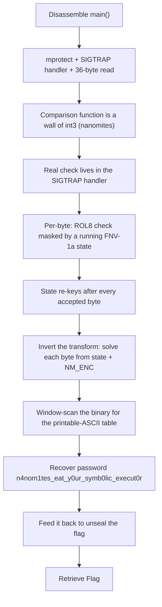

<h1 align="center">🌀 CoilVM</h1>
<p align="center">
  <b>MetaCTF September 2026 Flash CTF Reverse Engineering Write-Up</b>
</p>
<p align="center">
  <a href="https://compete.metactf.com/652/"></a>
  
  
</p>
<p align="center">
  Nanomites, SIGTRAP Handlers, an FNV-1a Key Schedule, and Static Emulation
</p>

---

# 📋 Environment

| Item       | Value                                                                                                        |
| ---------- | ------------------------------------------------------------------------------------------------------------ |
| Event      | [MetaCTF September 2026 Flash CTF](https://compete.metactf.com/652/) (MetaCTF has since rebranded as SkillBit) |
| Category   | Reverse Engineering                                                                                          |
| Difficulty | Hard (200 pts, solved by 117 teams)                                                                          |
| Tools Used | objdump, Python 3                                                                                            |
| Techniques | Nanomite recognition, SIGTRAP handler analysis, FNV-1a key schedule inversion, static emulation              |

---

# 🗺️ Overview

> *Something inside the coil watches every choice you feed it, tightening or slackening in response before it lets the next test through. Rush it and it forgets nothing kindly. Wind it just right, all the way to the end, and it finally lets go of what it's been holding.*

CoilVM is a **nanomite crackme**: a stripped x86-64 ELF that reads a password from stdin and, if it's correct, unseals and prints a flag. The comparison routine contains no useful logic at all, just a wall of `int3` software breakpoints. The real per-byte check lives inside the `SIGTRAP` handler that catches each trap, and that handler re-keys itself with a running **FNV-1a hash** after every accepted byte.

The challenge walks through:
* 🔍 Recognizing the nanomite pattern behind an empty-looking comparison function
* 🪤 Reading the check logic out of the signal handler
* 🔑 Inverting the FNV-1a key schedule to recover the password one byte at a time
* 🚩 Feeding the password back to unseal the flag

The story describes the mechanism exactly. The coil "tightens or slackening in response before it lets the next test through" is the hash re-keying after each byte. "Rush it and it forgets nothing kindly" is the timing gate that poisons the key if you step too slowly. And "wind it just right, all the way to the end" is that only a fully correct 36-byte password unseals the flag.

---

# 📑 Table of Contents

1. [Step 1 - Mapping main()](#step-1---mapping-main)
2. [Step 2 - The Decoy](#step-2---the-decoy)
3. [Step 3 - Recognizing the Nanomites](#step-3---recognizing-the-nanomites)
4. [Step 4 - Reading the Handler as a VM](#step-4---reading-the-handler-as-a-vm)
5. [Step 5 - Inverting the Key Schedule](#step-5---inverting-the-key-schedule)
6. [Step 6 - Unsealing the Flag](#step-6---unsealing-the-flag)
7. [Attack Chain Summary](#attack-chain-summary)
8. [Lessons and Takeaways](#lessons-and-takeaways)

---

# Step 1 - Mapping main()

The handout is a single stripped ELF. Disassembling `main` shows four things worth noting before touching the comparison function:

* It **`mprotect`s** the page containing the check routine to be writable, a hint that something in that region is modified at runtime.
* It installs an **`SA_SIGINFO` handler for `SIGTRAP`**.
* It runs a calibration pass, then **`read`s exactly 36 bytes** (`0x24`) from stdin.
* It calls the check, and only if nothing failed, calls the unseal-and-print routine.

```text
40163f: call sysconf         ; page size
40165d: call mprotect        ; make the check page writable
4016a8: call sigaction       ; install SIGTRAP handler (0x401196)
401700: call read            ; read 36 bytes of input
```

---

# Step 2 - The Decoy

`strings` turns up no `SkillBit{...}` anywhere, but it does turn up bait:

```text
$ strings coilvm | grep -i vm
C01L_VM_d3c0y_d0_n0t_b3l13v3_th15_str1ng
```

One short routine loads that string and `strcmp`s the input against it, so it looks like the password check. But nothing on `main`'s accepting path ever calls it. Typing the string in just prints `nope`, the same as any other wrong guess. It's there to catch a quick `strings`-and-`strcmp` guess.

---

# Step 3 - Recognizing the Nanomites

Disassembling the comparison function directly is useless. It's a long run of `0xCC` bytes (`int3`) interleaved with loads from a scratch variable:

```text
40155b: int3
40155c: movzx edx, BYTE PTR [rip+0x2aed]   ; scratch byte
...
401572: int3
401589: int3
4015a0: int3
```

Each `0xCC` traps into the kernel and delivers `SIGTRAP`. Because `int3` is a trap (not a fault), the saved instruction pointer already points one byte past the breakpoint, so the handler can simply return and execution resumes at the next site with no fix-up. That's what lets the whole comparison hide behind code that disassembles into nothing. This is the classic **nanomite** technique.

The writable mapping from Step 1 explains itself here. Each trap rewrites one scratch byte in the code page. That looks like self-modifying code, but the rewritten byte is never executed as an instruction. It only desyncs a naive linear disassembly, and nothing more.

The calibration pass in `main` runs the check once before any input is read, so the handler can record the resume address of each trap in the order they fire. That builds a table mapping each trap's address to a byte index, so the real run knows which password position it's checking at each trap.

---

# Step 4 - Reading the Handler as a VM

The real logic is in the `SIGTRAP` handler at `0x401196`. Reconstructed, the per-byte check is:

```python
state = 0x811C9DC5                             # FNV-1a 32-bit offset basis
for i in range(36):
    target   = NM_ENC[i] ^ (state & 0xFF)
    t        = ROL8(input[i] ^ (state & 0xFF), (state >> 5) & 7)
    accept iff t == target
    state    = (state ^ input[i]) * 0x01000193 # FNV-1a prime, 32-bit wrap
```

`NM_ENC` is a 36-byte table in `.rodata`. The constants `0x811C9DC5` and `0x01000193` are the standard FNV-1a 32-bit basis and prime, and they appear as plain immediates in the disassembly once you know to look:

```text
401713: mov DWORD PTR [...], 0x811c9dc5      ; state = FNV basis
401287: imul eax, eax, 0x1000193             ; state *= FNV prime
```

The important part is that **block `i`'s target is masked by `state`, and `state` depends on every earlier accepted byte**. So there's no fixed system of 36 independent equations to hand a solver. Each equation only resolves once the ones before it are solved. This is the "coil" from the description, re-keying itself after every byte.

> [!NOTE]
> The handler also reads `rdtsc` at the start and end of each trap. If the gap since the previous trap is too large, it XORs `state` with `0xA5A5A5A5` and poisons the whole schedule. A `ptrace` single-step loop or a debugger trips this every time and just prints `nope` with no explanation. That's "rush it and it forgets nothing kindly." Solving the schedule offline in Python sidesteps the gate entirely.

---

# Step 5 - Inverting the Key Schedule

There's no per-byte oracle to grind against. The binary reports pass or fail for all 36 bytes at once, and a 36-byte printable password is a space of 94³⁶, far past brute force. But the per-byte transform is **invertible**: given `NM_ENC[i]` and the current `state`, the accepted input byte can be solved directly, then folded into `state` exactly as the handler does:

```python
shift    = (state >> 5) & 7
target   = NM_ENC[i] ^ (state & 0xFF)
input[i] = ROR8(target, shift) ^ (state & 0xFF)   # undo the ROL
state    = (state ^ input[i]) * 0x01000193
```

Finding `NM_ENC` needs no symbol, since the binary is stripped. Slide a 36-byte window across the whole file, invert the schedule at every offset, and keep the one window whose recovered bytes are entirely printable ASCII. That candidate is unique and lands exactly on the real `.rodata` table:

```python
S0, PRIME, MASK, N = 0x811C9DC5, 0x01000193, 0xFFFFFFFF, 36

def ror8(x, k):
    k &= 7
    return ((x >> k) | (x << (8 - k))) & 0xFF if k else x & 0xFF

def invert(nm):
    state, out = S0, bytearray()
    for enc in nm:
        shift = (state >> 5) & 7
        target = (enc ^ (state & 0xFF)) & 0xFF
        b = ror8(target, shift) ^ (state & 0xFF)
        out.append(b)
        state = ((state ^ b) * PRIME) & MASK
    return bytes(out)

data = open("coilvm", "rb").read()
for off in range(len(data) - N):
    cand = invert(data[off:off + N])
    if all(0x20 <= c <= 0x7E for c in cand):
        print(hex(off), cand)
        break
```

```text
0x20a0 b'n4nom1tes_eat_y0ur_symb0lic_execut0r'
```

The password is `n4nom1tes_eat_y0ur_symb0lic_execut0r`, and the winning window sits at file offset `0x20a0` (virtual address `0x4020a0`), exactly where `NM_ENC` lives.

---

# Step 6 - Unsealing the Flag

The flag is never stored in plaintext. When the correct password satisfies every trap, `main` reaches the unseal routine, which derives a keystream from the password and the **final** key state left after all 36 bytes were checked, then XORs it against an encrypted blob in `.rodata`. Only the right password drives the schedule to the right final state.

So the simplest finish is to feed the recovered password back to the binary:

```text
$ printf 'n4nom1tes_eat_y0ur_symb0lic_execut0r' | ./coilvm
SkillBit{n4nom1tes_eat_y0ur_symb0lic_execut0r}
```

---

# 🚩 Flag

```text
SkillBit{n4nom1tes_eat_y0ur_symb0lic_execut0r}
```

---

# Attack Chain Summary



---

# Lessons and Takeaways

## Techniques Encountered

|#|Technique|What It Did|Countermeasure|
|---|---|---|---|
|1|Nanomites (`int3` breakpoints)|Hid the comparison logic in a `SIGTRAP` handler|Read the handler, not the empty check function|
|2|FNV-1a key schedule|Re-keyed each byte's check from all prior bytes|Emulate the schedule forward, solving byte by byte|
|3|`rdtsc` timing gate|Poisoned the key under a debugger|Solve statically in Python, never run under a stepper|
|4|Decoy string + encrypted flag|No plaintext flag; a fake one to bait `strcmp`|Ignore the decoy; derive the flag from the real schedule|

---

## Key Habits Reinforced

* **An Empty Function Is a Clue:** A comparison routine full of `int3` and nothing else means the logic is elsewhere. Nanomites move it into the trap handler.
* **Recognize Standard Constants:** `0x811C9DC5` and `0x01000193` are FNV-1a. Spotting known crypto/hash constants in a disassembly shortcuts the whole analysis.
* **Invert Instead of Brute Force:** A stateful check that re-keys per byte can't be brute-forced, but if each step is invertible you can solve it forward in lockstep.
* **Solve Statically to Dodge Anti-Debug:** Timing gates and self-modifying code punish dynamic analysis. Reconstructing the math offline makes those defenses irrelevant.
* **Locate Data by Property, Not Symbol:** In a stripped binary, a window scan keyed on "the result must be printable ASCII" finds the table without any symbol to guide you.

---

Written by **TheDingo8MyBaby**
MetaCTF September 2026 Flash CTF • CoilVM
