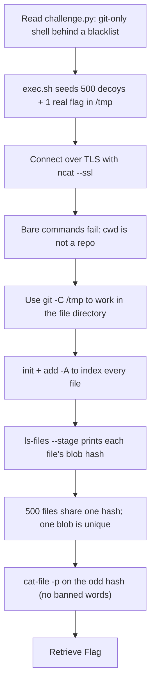

<h1 align="center">🔎 Git Sleuth</h1>
<p align="center">
  <b>MetaCTF September 2026 Flash CTF Other Write-Up</b>
</p>
<p align="center">
  <a href="https://compete.metactf.com/652/"></a>
  
  
</p>
<p align="center">
  Blacklist Bypass, a Restricted git Shell, and Blob-Hash Analysis
</p>

---

# 📋 Environment

| Item       | Value                                                                                                        |
| ---------- | ------------------------------------------------------------------------------------------------------------ |
| Event      | [MetaCTF September 2026 Flash CTF](https://compete.metactf.com/652/) (MetaCTF has since rebranded as SkillBit) |
| Category   | Other                                                                                                       |
| Difficulty | Medium (250 pts, solved by 101 teams)                                                                        |
| Tools Used | ncat (TLS), git                                                                                              |
| Techniques | Blacklist bypass, `git -C`, blob-hash comparison, `git cat-file`                                              |

---

# 🗺️ Overview

> *A long-abandoned repository resurfaces, its past stretching back through countless revisions. Somewhere in the routine commits, someone hid a record they never expected anyone to find. Comb through the history to recover it.*

Git Sleuth is a restricted, interactive `git` shell served over a TLS TCP connection. Every line you type is run as `git <line>`, but only after passing a blacklist of forbidden characters and keywords. The real flag sits in one file among hundreds of identical-looking decoys. To win, you have to drive `git` through the blacklist and read the contents of the one file that matters.

The challenge walks through:
* 🔌 Connecting over TLS and reading the source to understand the filter
* 🚫 Finding what the blacklist forgot to block
* 🗂️ Turning `/tmp` into a repo so `git` can index the files
* 🔑 Spotting the one file whose blob hash differs and reading it by hash

The source in the handout gives away the whole design, so the challenge is really about finding a chain of allowed `git` commands that still reads a file.

---

# 📑 Table of Contents

1. [Step 1 - The Filter](#step-1---the-filter)
2. [Step 2 - Connecting](#step-2---connecting)
3. [Step 3 - Finding the Repo](#step-3---finding-the-repo)
4. [Step 4 - The Odd Blob Out](#step-4---the-odd-blob-out)
5. [Step 5 - Reading It by Hash](#step-5---reading-it-by-hash)
6. [Attack Chain Summary](#attack-chain-summary)
7. [Lessons and Takeaways](#lessons-and-takeaways)

---

# Step 1 - The Filter

The handout includes `challenge.py`, which reads lines from the user, checks each space-separated token against a blacklist, and runs `git <line>` for anything that passes:

```python
DISALLOWED_CHARS = ["|", "\"", "'", ";", "$", "\\", "#", "*", "(", ")", "&", "^", "@",
    "!", "<", ">", "%", ":", ",", "?", "{", "}", "`", "diff", "/dev/null", "patch",
    "./", "alias", "push", "grep", "Fake", "Flag", "For", "Testing", "flag", "work",
    "remote", "update-ref", "lfs-remote"]
...
result = subprocess.run(["git"] + cmd.split(), check=True, text=True, capture_output=True)
```

The blacklist blocks shell metacharacters and the obvious read verbs: `grep`, `diff`, `patch`, and even the substrings `flag`, `Fake`, `Flag`. But it's a blacklist, and it only ever runs `git`. That's the weakness: `git` is a whole toolkit of subcommands, and several of them read repository content without any of the banned words.

The `exec.sh` script shows the setup: it drops **500 decoy `.txt` files** into `/tmp`, each containing the fake flag, plus **one** copy of the real `/flag.txt`, all named after random md5 hashes:

```sh
while [[ "${c}" -le 500 ]]; do
  echo "${flag}" > /tmp/"$(head -n 10 /dev/urandom | md5sum | cut -d ' ' -f1)".txt
  c=$((c + 1))
done
cp /flag.txt /tmp/"$(head -n 10 /dev/urandom | md5sum | cut -d ' ' -f1)".txt
```

So the real file is indistinguishable by name. It can only be told apart by its **contents**.

---

# Step 2 - Connecting

The service is TLS-wrapped, so plain `nc` gets an HTTP `400` from the load balancer. `ncat --ssl` connects properly:

```text
$ ncat --ssl <host> 1337
================= GitSleuth Quest =================
[?] A mysterious repository holds ancient secrets...
[!] Your mission: Uncover the sacred text within /flag.txt
[*] Use your git-fu wisely, brave adventurer
=================================================

Please enter git commands (Press Enter on an empty line to finish):
```

The prompt buffers every line until you submit a blank one, then runs the whole batch and prints the output together.

---

# Step 3 - Finding the Repo

The process runs from `/home/challenger`, which isn't a git repository, so any bare command fails:

```text
-C /tmp log --oneline --all
> fatal: not a git repository (or any of the parent directories): .git
```

But the files (and git's `safe.directory`) are in `/tmp`. The `-C <dir>` flag tells git which directory to work in, and it's not blocked. `/tmp` isn't a repo yet either, so the move is to make one there and index every file. `init`, `add`, and `ls-files` are all allowed:

```text
-C /tmp init
-C /tmp add -A
-C /tmp ls-files --stage
```

`git ls-files --stage` prints each staged file with its **blob hash**. That's the key: git hashes file *contents*, so identical files share a hash.

---

# Step 4 - The Odd Blob Out

The listing is 500-plus lines, and almost all of them share the same blob hash, because the decoys all contain the same fake-flag string:

```text
100644 937fc2f3a9653a549fe41c35f4e3102c02a3cad9 0  02c0fdd1ce88ce654caeec99e7f59fba.txt
100644 937fc2f3a9653a549fe41c35f4e3102c02a3cad9 0  0367f26da398e1dfff56af4b32361c08.txt
...
100644 35ab8c9e8787383f759aae2db4ee654c73080548 0  a5d64f13ec55d9a3013429968468bafd.txt
...
100644 937fc2f3a9653a549fe41c35f4e3102c02a3cad9 0  ffd8a67a86df235cff8f9afa306007ed.txt
```

Every decoy is `937fc2f3...`. Exactly one file has a different hash, `35ab8c9e...`. That's the real flag, and its unique content is what makes its blob hash stand out. The random filename never mattered; the content hash did.

---

# Step 5 - Reading It by Hash

`git cat-file -p <hash>` prints a blob's contents directly. It touches no filename and no banned word, so it sails through the filter. Reconnect and read the odd blob:

```text
$ ncat --ssl <host> 1337
...
-C /tmp cat-file -p 35ab8c9e8787383f759aae2db4ee654c73080548

SkillBit{R3m3mb3r_t0_4lw4ys_3sc4p3_G1t_C0mm4nds}
```

The flag's own text is the lesson: always escape (or better, allowlist) git commands.

---

# 🚩 Flag

```text
SkillBit{R3m3mb3r_t0_4lw4ys_3sc4p3_G1t_C0mm4nds}
```

---

# Attack Chain Summary



---

# Lessons and Takeaways

## Vulnerabilities Encountered

|#|Vulnerability|CWE|Location|
|---|---|---|---|
|1|Blacklist instead of allowlist|CWE-184|`challenge.py` `DISALLOWED_CHARS`|
|2|Over-powerful allowed command (`git`)|CWE-77|Every line run as `git <input>`|
|3|Secret hidden by obscurity, not access control|CWE-656|`exec.sh` decoy scheme|

---

## Key Habits Reinforced

* **Blacklists Lose:** Banning bad tokens fails because there are too many ways to express the same intent. `grep` blocked? Use `show`. `cat` blocked? Use `cat-file`. Allowlist safe subcommands instead.
* **git Is a File-Reading Toolkit:** `git show`, `git ls-files`, `git ls-tree` and `git cat-file` all expose repository content without ever touching a shell.
* **Hash the Content, Not the Name:** 500 lookalike filenames are useless as camouflage once git indexes them. Identical files share a blob hash, so the one different hash is the target.
* **`-C` Beats `cd`:** When you can only run one binary, its own "change directory" flag gets you where you need to be without a shell.

---

Written by **TheDingo8MyBaby**
MetaCTF September 2026 Flash CTF • Git Sleuth
