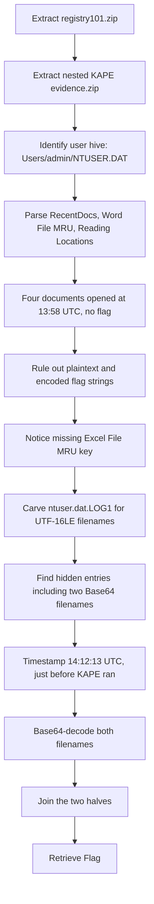

<h1 align="center">🗝️ Registry101</h1>
<p align="center">
  <b>MetaCTF September 2026 Flash CTF Forensics Write-Up</b>
</p>
<p align="center">
  <a href="https://compete.metactf.com/652/"></a>
  
  
</p>
<p align="center">
  KAPE Triage, NTUSER.DAT, Registry Transaction Logs, MRU Artifacts, and Base64
</p>

---

# 📋 Environment

| Item       | Value                                                                                         |
| ---------- | --------------------------------------------------------------------------------------------- |
| Event      | [MetaCTF September 2026 Flash CTF](https://compete.metactf.com/652/) (MetaCTF has since rebranded as SkillBit) |
| Category   | Forensics                                                                                     |
| Difficulty | Easy (200 pts, solved by 53 teams)                                                            |
| Tools Used | Python 3, regipy, unzip, grep                                                                 |
| Techniques | Registry hive parsing, RecentDocs / Office File MRU analysis, transaction log (`.LOG1`) carving |

---

# 🗺️ Overview

> *Peter keeps denying that he ever accessed my important documents. I may not have seen him doing it with my own eyes, but I'm convinced you can uncover the evidence that proves otherwise.*

Registry101 is a Windows registry forensics challenge built on a KAPE triage collection. The goal is to prove that documents were opened on the machine, even though the evidence has been scrubbed from the places an analyst would normally look.

The challenge walks through:
* 📦 Triage of a KAPE collection from a Windows 10 host
* 🔎 Reading user activity artifacts (RecentDocs, Office File MRU, Reading Locations, UserAssist)
* 🧾 Understanding why a "clean" hive is not the whole story
* 🪵 Carving uncommitted data out of the registry transaction logs (`ntuser.dat.LOG1`)
* 🔑 Decoding Base64-encoded filenames to reconstruct the flag

The key insight is in the description itself: *"I may not have seen him doing it with my own eyes."* The evidence isn't in the hive you open. It's in the registry changes Windows had logged but not yet written back.

---

# 📑 Table of Contents

1. [Step 1 - Unpacking the Evidence](#step-1---unpacking-the-evidence)
2. [Step 2 - The Obvious Artifacts](#step-2---the-obvious-artifacts)
3. [Step 3 - Dead Ends](#step-3---dead-ends)
4. [Step 4 - Carving the Transaction Logs](#step-4---carving-the-transaction-logs)
5. [Step 5 - Decoding the Flag](#step-5---decoding-the-flag)
6. [Attack Chain Summary](#attack-chain-summary)
7. [Lessons and Takeaways](#lessons-and-takeaways)

---

# Step 1 - Unpacking the Evidence

The download contains a nested archive, `registry101/evidence.zip`. Its zip comment identifies the source:

```text
Created by KAPE version 1.3.0.2 on 2025-09-23T14:14:50.1345088Z
```

The collection is a typical KAPE target set. It contains:

* **System hives:** `SAM`, `SECURITY`, `SOFTWARE`, `SYSTEM` and `DEFAULT`, each with its `.LOG1`/`.LOG2` transaction logs.
* **User hives:** `NTUSER.DAT` and `UsrClass.dat` for the single user `admin`, plus their transaction logs.
* **Other artifacts:** Edge browser data, PowerShell history, event logs, Defender logs, OneDrive logs and the Windows Search database.

A quick check of the `SAM` and `SOFTWARE` hives confirms that the only real local account is `admin`. There is no user called Peter. So the task is not about finding Peter's account; it's about proving that documents were accessed at all.

| Host detail      | Value                                   |
| ---------------- | --------------------------------------- |
| Computer name    | `WIN10`                                 |
| OS               | Windows 10 IoT Enterprise LTSC 2021     |
| Registered owner | `WhiteIoT`                              |
| User profile     | `C:\Users\admin`                        |

---

# Step 2 - The Obvious Artifacts

The user hive `NTUSER.DAT` is the natural starting point for "who opened what." I parsed it with `regipy` and dumped the standard file-access keys.

```python
from regipy.registry import RegistryHive

h = RegistryHive('Users/admin/NTUSER.DAT')
k = h.get_key(r'\Software\Microsoft\Office\16.0\Word\File MRU')
for v in k.iter_values():
    print(v.name, v.value)
```

**Word File MRU** (`Software\Microsoft\Office\16.0\Word\File MRU`):

```text
Item 1  [T01DC2C9220A47B50]*C:\Users\admin\Documents\HR_EmployeeList_2019.docx
Item 2  [T01DC2C921FD08980]*C:\Users\admin\Documents\Giao-an-Talon.docx
Item 3  [T01DC2C921F56ECB0]*C:\Users\admin\Documents\Dwrap.docx
Item 4  [T01DC2C921DFADF20]*C:\Users\admin\Documents\Create Virtual Hard Drive.docx
```

The `[T…]` field is a hex FILETIME. All four resolve to about **2025-09-23 13:58 UTC**.

The other artifacts tell the same story:

* **RecentDocs:** lists the same four `.docx` files, plus `HR_EmployeeList_2019.xlsx`, `commande.txt` and `Configuration.xml`.
* **Reading Locations:** Word's resume-reading positions show all four documents, stamped `2025-09-23T21:07` in local time (UTC+7).
* **UserAssist:** shows Word and Excel being launched, along with a lot of unrelated noise such as KMSpico, DefenderRemover and PsExec64.

> [!TIP]
> Office MRU timestamps are FILETIMEs in hex. Convert them with
> `datetime(1601,1,1) + timedelta(microseconds=int(hex_value, 16) // 10)`.

This proves some document access, but none of it looks like a flag.

---

# Step 3 - Dead Ends

Before finding the real evidence, I ruled out the obvious places a flag could be hiding in plain text. This step matters for the write-up because it shows *why* the answer had to be somewhere unusual.

| Attempt | Result |
| ------- | ------ |
| `grep` every file for `MetaCTF`, `flag{`, `peter` (ASCII and UTF-16LE) | Only hit: the time zone string "Moscow, St. Petersburg" |
| Search for encoded prefixes (Base64, hex, ROT13, reversed `MetaCTF`) | Nothing |
| Regex for `word{...}` patterns across all hives | Only random noise in `SOFTWARE` |
| Edge History and Downloads | Office activation sites and an OfficeSetup download only |
| ShellBags in `UsrClass.dat` | Temp folders, KMSpico and MiniTool directories |
| OneDrive logs | Telemetry noise |

The Excel **File MRU** key was also conspicuously missing from `NTUSER.DAT`, even though RecentDocs shows an `.xlsx` was opened. That suggested entries had been removed from the committed hive.

> [!IMPORTANT]
> An empty or missing key is a finding, not a dead end. If one artifact says a file was opened and another has no record of it, something has been cleaned up.

---

# Step 4 - Carving the Transaction Logs

Windows doesn't write registry changes straight into a hive file. It first records them in the transaction logs (`.LOG1` / `.LOG2`) and writes them into the hive later. If the system is imaged before that happens, the newest changes exist **only in the logs**. A parser that reads just `NTUSER.DAT` will never see them. That is exactly the "didn't see it with my own eyes" clue.

Rather than replaying the logs, I carved them directly. The script searches every user hive and log for UTF-16LE document filenames:

```python
import re, glob

files = glob.glob('Users/admin/ntuser.dat*') + glob.glob('Users/admin/NTUSER*')
for f in files:
    d = open(f, 'rb').read()
    for ext in ['.xlsx', '.docx', '.pdf', '.txt']:
        for m in re.finditer(re.escape(ext.encode('utf-16le')), d):
            s = d[max(0, m.start()-200):m.start()+len(ext)*2].decode('utf-16le', 'replace')
            s = re.split(r'[\x00-\x1f\ufffd]', s)[-1]
            print(f.split('/')[-1], '|', s)
```

`ntuser.dat.LOG1` contained several files that appear **nowhere** in the committed hive:

```text
ntuser.dat.LOG1 | Payroll_May2024.xlsx
ntuser.dat.LOG1 | Supplier_List_Approved_2024.xlsx
ntuser.dat.LOG1 | Supplier_Quote_Steel_2024.xlsx
ntuser.dat.LOG1 | Ryze.docx
ntuser.dat.LOG1 | T8.docx
ntuser.dat.LOG1 | IU1ldGFDVEZ7RjFyNXRfc3QzcF8=.docx
ntuser.dat.LOG1 | Ml9yM2cxc3RyeV80YW5kNn0=.xlsx
ntuser.dat.LOG1 | [F00000000][T01DC2C940EE0D5B0][O00000000]*C:\Users\admin\Documents\IU1ldGFDVEZ7RjFyNXRfc3QzcF8=.docx
```

Two filenames stand out immediately: they are Base64 strings ending in `=` padding.

The Word MRU entry for the `.docx` gives a timestamp too. `T01DC2C940EE0D5B0` converts to **2025-09-23 14:12:13 UTC** (21:12 local). That is about two and a half minutes before KAPE started collecting at 14:14:50 UTC, which explains why the change never reached the hive.

---

# Step 5 - Decoding the Flag

Decoding the two filenames:

```python
import base64
for s in ['IU1ldGFDVEZ7RjFyNXRfc3QzcF8=', 'Ml9yM2cxc3RyeV80YW5kNn0=']:
    print(base64.b64decode(s))
```

```text
b'!MetaCTF{F1r5t_st3p_'
b'2_r3g1stry_4and6}'
```

Joining the two halves in order gives the flag. The first half starts with a stray `!` before the `MetaCTF{` wrapper. The `!` is not part of the accepted flag, so it is dropped and the flag is submitted as `MetaCTF{...}`.

> [!NOTE]
> If a decoded flag has an odd leading or trailing character, try it both with and without. Here the version without the `!` was accepted.

---

# 🚩 Flag

```text
MetaCTF{F1r5t_st3p_2_r3g1stry_4and6}
```

---

# Attack Chain Summary



---

# Lessons and Takeaways

## Artifacts Used

|#|Artifact|Location|What It Proved|
|---|---|---|---|
|1|Word File MRU|`NTUSER.DAT\Software\Microsoft\Office\16.0\Word\File MRU`|Documents opened, with timestamps|
|2|RecentDocs|`NTUSER.DAT\Software\Microsoft\Windows\CurrentVersion\Explorer\RecentDocs`|Files opened through the shell, grouped by extension|
|3|Reading Locations|`NTUSER.DAT\Software\Microsoft\Office\16.0\Word\Reading Locations`|Documents were actually read in Word|
|4|Transaction log|`Users\admin\ntuser.dat.LOG1`|Uncommitted MRU entries that never reached the hive|

---

## Key Habits Reinforced

* **Always Collect and Check the Logs:** A hive without its `.LOG1`/`.LOG2` files is incomplete. Tools like Registry Explorer will offer to replay dirty hives; accept, or carve the logs yourself as done here.
* **Cross-Check Artifacts Against Each Other:** RecentDocs showed an `.xlsx` was opened, but there was no Excel File MRU. That inconsistency pointed straight at missing data.
* **Mind the Clock:** The flag entry was written about two and a half minutes before collection. Anything that recent may not be in the committed hive yet.
* **Search in UTF-16LE:** Registry strings are stored as UTF-16LE. A plain ASCII `grep` would have missed every filename in this challenge.

---

Written by **TheDingo8MyBaby**
MetaCTF September 2026 Flash CTF • Registry101
