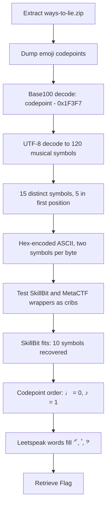

<h1 align="center">🎼 Ways To Lie</h1>
<p align="center">
  <b>MetaCTF September 2026 Flash CTF Cryptography Write-Up</b>
</p>
<p align="center">
  <a href="https://compete.metactf.com/652/"></a>
  
  
</p>
<p align="center">
  Base100, Unicode Codepoint Analysis, and a Musical Hex Substitution Cipher
</p>

---

# 📋 Environment

| Item       | Value                                                                                                        |
| ---------- | ------------------------------------------------------------------------------------------------------------ |
| Event      | [MetaCTF September 2026 Flash CTF](https://compete.metactf.com/652/) (MetaCTF has since rebranded as SkillBit) |
| Category   | Cryptography                                                                                                 |
| Difficulty | Medium (300 pts, solved by 96 teams)                                                                         |
| Tools Used | Python 3, unzip                                                                                              |
| Techniques | Base100 decoding, codepoint analysis, nibble substitution, known-plaintext crib, leetspeak context           |

---

# 🗺️ Overview

> *The conservatory archive kept one honest page and ninety nine forgeries. Every copyist who passed through left a version behind, each prettier than the last, and the archivist who could tell them apart died without writing any of it down.*
>
> *One sheet survives. It came back from the binder covered in someone else's idea of decoration, and the last person to hold it swore the truth was still in there, sitting in plain sight for anyone patient enough to look twice.*

Ways To Lie is a two-layer encoding challenge. The handout is a single file of emoji, with no service to talk to and no key anywhere. The outer layer is Base100, and removing it reveals a string of musical symbols. Those symbols are a substitution cipher over hex digits, where every two symbols make one byte of the flag.

The challenge walks through:
* 🔍 Spotting Base100 from the emoji codepoints rather than the pictures
* 🎵 Profiling the musical-symbol layer to identify the cipher
* 🔑 Using the event's known flag wrapper as a crib to recover most of the alphabet
* 🎹 Filling in the rest from Unicode order and the flag's own words

The story hints at both layers. "Covered in someone else's idea of decoration" is the emoji wrapping. The "conservatory" points at the music. And "look twice" is the key to the inner layer: each character of the flag is written as two symbols.

---

# 📑 Table of Contents

1. [Step 1 - Reading the Handout](#step-1---reading-the-handout)
2. [Step 2 - Peeling Off Base100](#step-2---peeling-off-base100)
3. [Step 3 - Profiling the Music](#step-3---profiling-the-music)
4. [Step 4 - Cribbing the Flag Wrapper](#step-4---cribbing-the-flag-wrapper)
5. [Step 5 - Finishing the Alphabet](#step-5---finishing-the-alphabet)
6. [Step 6 - The Solve Script](#step-6---the-solve-script)
7. [Attack Chain Summary](#attack-chain-summary)
8. [Lessons and Takeaways](#lessons-and-takeaways)

---

# Step 1 - Reading the Handout

The archive contains one file, `ways-to-lie/flag.txt`. Printing it shows nothing but emoji:

```text
📙💐💥📙💐💣📙💐💦📧💔👻💢📙💐💦📧💔👻💘📙💐💦📧💔👻💇📙💐💦📧💔👻💇...
```

The pictures are meaningless. What matters is the **codepoints**:

```python
s = open('ways-to-lie/flag.txt', encoding='utf-8').read()
print([hex(ord(c)) for c in s[:13]])
```

```text
['0x1f4d9', '0x1f490', '0x1f4a5', '0x1f4d9', '0x1f490', '0x1f4a3', '0x1f4d9',
 '0x1f490', '0x1f4a6', '0x1f4e7', '0x1f494', '0x1f47b', '0x1f4a2']
```

Every character sits in a narrow band around `U+1F400`, and the file is made of repeating three-emoji groups (starting 📙 💐) and four-emoji groups (starting 📧 💔 👻). A three-and-four pattern like that looks like UTF-8, where characters take three or four bytes. That points to an encoding that maps each **byte** to one emoji.

---

# Step 2 - Peeling Off Base100

Base100 (also called "emoji encoding") does exactly that. It writes every byte as one emoji at a fixed offset:

```text
emoji = chr(0x1F3F7 + byte)
```

Undoing it is a subtraction, and the resulting bytes decode as UTF-8:

```python
BASE100_OFFSET = 0x1F3F7
emoji = open('ways-to-lie/flag.txt', encoding='utf-8').read().strip()
notes = bytes(ord(c) - BASE100_OFFSET for c in emoji).decode('utf-8')
print(notes)
```

```text
♮♬♯𝄫♯𝄡♯𝄐♯𝄐♭♫♯𝄡𝄞♭𝄞𝄫♬♭♯𝄑♬♩♯𝄒♬𝄡♮𝄓♬♪♬♩♬♩♮𝄓♮𝄞♬♭𝄞𝄡♬♮♮𝄓♬𝄞♬♩♮𝄓♭𝄐♬♪♬♬♮𝄓♮𝄡♬♩𝄞♮♮𝄓♬♭♯♬𝄞♭𝄞♮♬♭♯𝄐♯𝄐𝄞𝄡♮𝄓♭♯♬♩𝄞♮♯𝄒♯♭♮𝄓♬𝄞♯𝄢♬♬♮𝄓♬𝄞𝄞♫𝄞♮♬𝄞♯𝄢𝄞𝄑
```

The first group, 📙 💐 💥, becomes the bytes `E2 99 AE`, which is `♮` (MUSIC NATURAL SIGN). The three-byte groups are symbols from `U+2669`–`U+266F`, and the four-byte groups are from the Musical Symbols block (`U+1D100` and up). The conservatory theme is confirmed.

> [!TIP]
> When a file is all emoji, ignore how they look and dump the codepoints. If every one of them falls inside a 256-wide window starting at `U+1F3F7`, it's Base100 and needs no key.

---

# Step 3 - Profiling the Music

The musical string has **120 symbols** but only **15 distinct ones**:

| Symbol | Codepoint | Count | Symbol | Codepoint | Count |
| :----: | --------- | ----: | :----: | --------- | ----: |
| ♩ | `U+2669` | 6  | 𝄐 | `U+1D110` | 5  |
| ♪ | `U+266A` | 2  | 𝄑 | `U+1D111` | 2  |
| ♫ | `U+266B` | 2  | 𝄒 | `U+1D112` | 2  |
| ♬ | `U+266C` | 24 | 𝄓 | `U+1D113` | 9  |
| ♭ | `U+266D` | 10 | 𝄞 | `U+1D11E` | 16 |
| ♮ | `U+266E` | 17 | 𝄡 | `U+1D121` | 6  |
| ♯ | `U+266F` | 15 | 𝄢 | `U+1D122` | 2  |
|   |          |    | 𝄫 | `U+1D12B` | 2  |

Fifteen symbols is almost exactly sixteen, the number of hex digits. And 120 symbols is exactly twice 60, a normal length for a flag. So **each symbol is one hex digit (a nibble), and each pair of symbols is one byte**. Fifteen instead of sixteen just means one hex digit never appears in this flag.

Counting only the **first** symbol of each pair confirms it:

```python
from collections import Counter
print(Counter(notes[0::2]))
```

```text
Counter({'♬': 20, '♯': 14, '♮': 12, '𝄞': 11, '♭': 3})
```

Only **5** different symbols ever appear first in a pair. For printable ASCII, the first hex digit of a byte can only be `2` through `7`, so this is hex-encoded ASCII behind a substitution alphabet.

---

# Step 4 - Cribbing the Flag Wrapper

A substitution cipher falls quickly with known plaintext, and the flag supplies some. Flags from this organizer are wrapped in either **`SkillBit{…}`** or **`MetaCTF{…}`** (MetaCTF rebranded as SkillBit, and both prefixes are in use). Whichever it is, the flag has to start with that prefix and end with `}`.

Each prefix predicts the hex digits at the start of the ciphertext. Lining each one up against the symbols and checking that no symbol gets two different values tells you which one it is:

```python
def crib(prefix):
    mapping = {}
    for symbol, nibble in zip(notes, prefix.encode().hex()):
        if mapping.setdefault(symbol, nibble) != nibble:
            return None, (symbol, mapping[symbol], nibble)
    return mapping, None

for prefix in ['MetaCTF{', 'SkillBit{']:
    mapping, conflict = crib(prefix)
    print(prefix, prefix.encode().hex(), 'CONFLICT ' + str(conflict) if conflict else 'OK')
```

```text
MetaCTF{ 4d6574614354467b CONFLICT ('♯', '6', '7')
SkillBit{ 536b696c6c4269747b OK
```

`MetaCTF{` fails straight away: it needs `♯` to be both `6` and `7`. `SkillBit{` fits all 18 hex digits with no conflicts, so that's the wrapper. The closing `}` (`0x7D`) is the last pair, `𝄞𝄑`, which adds `𝄑 = d`.

That's 10 of the 15 symbols from the wrapper alone:

| Symbol | ♫ | ♬ | ♭ | ♮ | ♯ | 𝄞 | 𝄡 | 𝄫 | 𝄐 | 𝄑 |
| ------ | - | - | - | - | - | - | - | - | - | - |
| Nibble | 2 | 3 | 4 | 5 | 6 | 7 | 9 | b | c | d |

Decoding with just these, using `?` for unknown bytes, shows most of the flag:

```text
SkillBit{4m??9?????W4y5?7??L?3?Y?u?4ctu4lly?F?u?d?7?3?7ru7?}
```

---

# Step 5 - Finishing the Alphabet

Five symbols remain: `♩`, `♪`, `𝄒`, `𝄓` and `𝄢`.

**Unicode order gives two.** The crib assigned `♫ ♬ ♭ ♮ ♯` the values `2 3 4 5 6`, and those symbols sit at consecutive codepoints `U+266B`–`U+266F`. The alphabet was built by walking the block in order, so the two symbols just before them, `♩` (`U+2669`) and `♪` (`U+266A`), are `0` and `1`:

```text
SkillBit{4m0?9?100?W4y5?70?L13?Y0u?4ctu4lly?F0u?d?7?3?7ru7?}
```

**The words give the last three.** The flag is now plain leetspeak, and each gap has one obvious reading:

| Symbol | Where it appears | Reading | Byte | Nibble |
| :----: | ---------------- | ------- | ---- | :----: |
| 𝄓 | the 9 gaps between words (`♮𝄓`) | `_` | `0x5F` | f |
| 𝄒 | `4m0?9`, `F0u?d` → "among", "found" | `n` | `0x6E` | e |
| 𝄢 | `7?3`, `7ru7?` → "the", "truth" | `h` | `0x68` | 8 |

The finished alphabet:

| Nibble | 0 | 1 | 2 | 3 | 4 | 5 | 6 | 7 | 8 | 9 | a | b | c | d | e | f |
| ------ | - | - | - | - | - | - | - | - | - | - | - | - | - | - | - | - |
| Symbol | ♩ | ♪ | ♫ | ♬ | ♭ | ♮ | ♯ | 𝄞 | 𝄢 | 𝄡 | *(unused)* | 𝄫 | 𝄐 | 𝄑 | 𝄒 | 𝄓 |

Two things are worth noting:

* **𝄢 and 𝄡 are swapped.** 𝄢 (`U+1D122`) is `8` and 𝄡 (`U+1D121`) is `9`, the reverse of their codepoint order. That's why the last three symbols were read from the words rather than from Unicode order.
* **Nibble `a` has no symbol.** No byte in the flag contains an `a` digit, which is why only 15 distinct symbols appear.

---

# Step 6 - The Solve Script

With the alphabet known, the whole decode fits in a few lines:

```python
#!/usr/bin/env python3
"""Ways To Lie solver: base100 -> musical-symbol hex -> ASCII."""
import sys

BASE100_OFFSET = 0x1F3F7

# Nibble alphabet recovered during the solve: 10 symbols from the SkillBit{...}
# crib, 2 from codepoint order, 3 from the leetspeak words.
# Nibble 'a' never occurs in the plaintext, so it has no symbol here.
NOTE_TO_NIBBLE = dict(zip("♩♪♫♬♭♮♯𝄞𝄢𝄡𝄫𝄐𝄑𝄒𝄓", "0123456789bcdef"))

def main(path="flag.txt"):
    emoji = open(path, encoding="utf-8").read().strip()
    notes = bytes(ord(c) - BASE100_OFFSET for c in emoji).decode("utf-8")
    hexstr = "".join(NOTE_TO_NIBBLE[n] for n in notes)
    print(bytes.fromhex(hexstr).decode())

if __name__ == "__main__":
    main(*sys.argv[1:])
```

Execution output:

```text
$ python3 solve.py ways-to-lie/flag.txt
SkillBit{4m0n9_100_W4y5_70_L13_Y0u_4ctu4lly_F0und_7h3_7ru7h}
```

The flag reads "among 100 ways to lie, you actually found the truth", which ties back to the "one honest page and ninety nine forgeries" in the story.

---

# 🚩 Flag

```text
SkillBit{4m0n9_100_W4y5_70_L13_Y0u_4ctu4lly_F0und_7h3_7ru7h}
```

---

# Attack Chain Summary



---

# Lessons and Takeaways

## Layers Encountered

|#|Layer|Type|How It Was Broken|
|---|---|---|---|
|1|Emoji|Base100 encoding|Subtract `0x1F3F7` from every codepoint|
|2|Musical symbols|Hex nibble substitution|Flag-wrapper crib, codepoint order and leetspeak context|

---

## Key Habits Reinforced

* **Read Codepoints, Not Pictures:** A quick `hex(ord(c))` dump identified Base100 immediately and later exposed the order of the alphabet.
* **Count Before You Guess:** 15 distinct symbols, 120 total, and only 5 in the first position of each pair identified hex-encoded ASCII before any value was known.
* **Know the Flag Format:** The organizer's wrappers (`SkillBit{}` or `MetaCTF{}`) are free known plaintext. Testing both against the ciphertext picked the right one and recovered two-thirds of the alphabet in one step.
* **Check Patterns Against the Words:** Unicode order held for the first block but not for 𝄢/𝄡, so the final symbols were read from the plaintext.

---

Written by **TheDingo8MyBaby**
MetaCTF September 2026 Flash CTF • Ways To Lie
